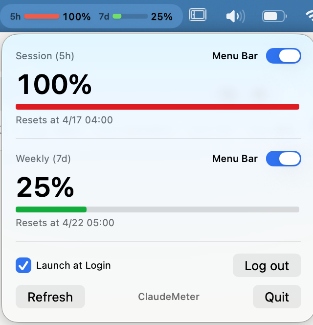

# ClaudeMeter

A macOS menu bar app that shows your Claude session (5h) and weekly (7d) usage at a glance.


## Features

- **Menu bar indicator** with colored progress bars (green / yellow / red) and percentages
- **5-hour session** and **7-day rolling** usage tracking
- **Zero-login setup** — reuses the OAuth credentials of the [Claude Code CLI](https://docs.claude.com/en/docs/claude-code) already installed on your Mac
- **Auto-refresh** every 60 seconds (no tokens consumed — queries a metadata-only endpoint)
- **Launch at login** option
- Light/dark mode support

## Screenshot



Menu bar shows colored progress bars with percentages; click to expand the panel with session/weekly details, per-section visibility toggles, and login management.

## Requirements

- macOS 14 (Sonoma) or later
- Xcode 15+

## Is It Safe?

This is a fully open-source project — every line of code is visible in this repo. Don't take our word for it: **ask Claude, ChatGPT, or any AI you trust** to review the source code and confirm there's nothing malicious. The app only communicates with `api.anthropic.com` / `console.anthropic.com` (your existing Claude account, via the Claude Code CLI's credentials), stores all data locally, and includes zero analytics or telemetry.

## Install & Upgrade

### Option 1: Download (recommended)

1. Download `ClaudeMeter.zip` from the [latest release](https://github.com/seolsnow/ClaudeMeter/releases/latest)
2. Unzip and drag `ClaudeMeter.app` to `/Applications`

### Option 2: Homebrew

Install:

```bash
brew tap seolsnow/tap
brew install --cask claudemeter
```

Upgrade:

```bash
brew update
brew upgrade --cask claudemeter
```

### Option 3: Build from source

Install:

```bash
git clone https://github.com/seolsnow/ClaudeMeter.git
cd ClaudeMeter
make install
```

Upgrade:

```bash
cd ~/seolsnow/ClaudeMeter   # path where you cloned it
git pull
make install
```

### macOS Security Warning

ClaudeMeter is ad-hoc signed (not notarized with an Apple Developer certificate, which costs $99/yr). On first launch, macOS will show one of these warnings:

**"Apple could not verify ClaudeMeter is free of malware"**

- **macOS Sequoia (15+):** System Settings → Privacy & Security → scroll down → click **"Open Anyway"** next to ClaudeMeter
- **macOS Sonoma (14):** right-click the app → **Open** → click **Open** in the dialog

**"ClaudeMeter is damaged and can't be opened"**

This happens when macOS adds a quarantine flag to apps downloaded from a browser. Run this once in Terminal, then open normally:

```bash
xattr -cr /Applications/ClaudeMeter.app
```

Prefer to verify safety yourself? The entire codebase is in this repo — ask any AI to review it, or build from source (Option 3).

## Setup

**Prerequisite:** You must have the [Claude Code CLI](https://docs.claude.com/en/docs/claude-code) installed and logged in on this Mac. ClaudeMeter reads its OAuth credentials from Keychain — it does not perform its own login.

1. Make sure `claude` (the CLI) works in your terminal and you're signed in
2. **Launch ClaudeMeter** — the widget appears in your menu bar
3. macOS may prompt you once to allow ClaudeMeter to read the Keychain item — click **Always Allow**
4. Done — your usage appears automatically

## How It Works

On each refresh cycle (every 60 seconds), ClaudeMeter:

1. Reads the OAuth access token from the `Claude Code-credentials` Keychain item (the same item the Claude Code CLI manages)
2. Calls `https://api.anthropic.com/api/oauth/profile` to identify the account
3. Calls `https://api.anthropic.com/api/oauth/usage` to get current usage windows
4. If the access token is close to expiry, refreshes it via `https://console.anthropic.com/v1/oauth/token`

These are metadata-only endpoints — **no model tokens are consumed**. The response includes:
- `five_hour.utilization` — percentage of your 5h session limit used
- `seven_day.utilization` — percentage of your 7d rolling limit used
- Reset timestamps for each window

## Privacy

- All data stays local on your machine
- No separate credential store — ClaudeMeter reads the OAuth token Claude Code CLI already placed in Keychain; refreshed tokens are held only in memory
- No data is sent anywhere except to Anthropic's official domains (`api.anthropic.com`, `console.anthropic.com`) using your existing account
- No analytics or telemetry

## Known Limitations

- **Requires Claude Code CLI to be installed and signed in.** ClaudeMeter intentionally does not implement its own login flow; it piggybacks on the CLI's credentials. If you have not used `claude login` on this Mac, the app will show "Not logged in".
- **Repeated Keychain prompts on ad-hoc-signed builds.** Because the release `.app` is ad-hoc signed, macOS may re-prompt for Keychain access on every refresh. Click **Always Allow** once; if prompts keep appearing, this is a known cdhash-pinning limitation that is resolved by signing with an Apple Developer certificate (not yet set up for this project).

## Troubleshooting

**Widget shows "Not logged in"**
- Open a terminal and confirm `claude` is installed and that `claude` commands work without prompting for login
- If you just installed the CLI, run any Claude Code command once to trigger the initial Keychain write
- Quit and relaunch ClaudeMeter after signing in

**Keychain prompt appears every 60 seconds**
- Click **Always Allow** in the dialog
- If it still re-prompts, see "Known Limitations" above — this is a signing limitation

**Widget stuck at 0% / stale values**
- Click the widget → **Refresh**
- If the error persists, the token may have expired; running any `claude` command in your terminal will refresh it

## Tech Stack

- Swift 6 / SwiftUI
- `MenuBarExtra` with `.window` style
- Keychain Services for reading Claude Code CLI's OAuth token
- `URLSession` with OAuth 2.0 Bearer auth against `api.anthropic.com`
- `XcodeGen` for project generation

## Acknowledgments

ClaudeMeter was built with awareness of — and respect for — excellent prior work in this space, including [ccusage](https://github.com/ryoppippi/ccusage) and [Codexbar](https://github.com/steipete/codexbar). Parts of the approach here were informed by studying how those projects solved similar problems, and full credit goes to their authors for blazing the trail.

ClaudeMeter exists because I wanted something slightly different: the lightest possible menu bar app that surfaces usage at a glance, with no CLI, no dashboard, no configuration — just a tiny gauge you can check in a fraction of a second. This is the result. If you need richer reporting, a CLI workflow, or features beyond what's here, the projects above may suit you better.

## License

MIT
